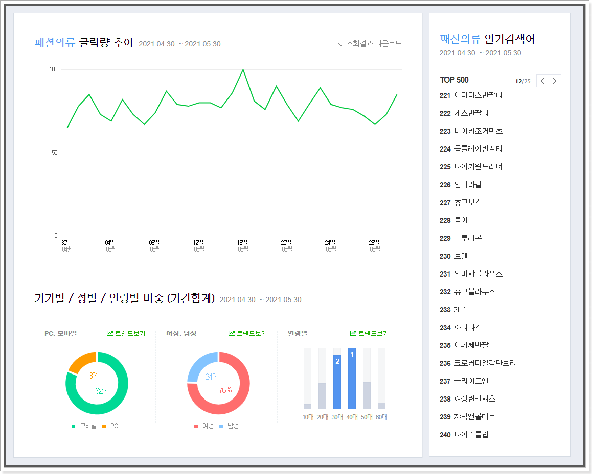
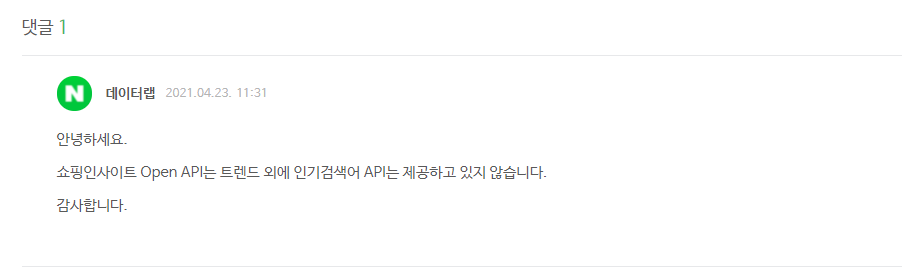

# 네이버 데이터랩 쇼핑인사이트 인기검색어 수집 프로그램

## 00. 동기

나와 가까운 지인과 이야기하던 도중 쇼핑인사이트에 있는 인기검색어 TOP 500을 일일이Excel로 옮기는 작업이 1~2시간 정도 걸려 골치아프다는 이야기를 들었다. 그래서 단순 반복 작업을 줄이고 소중한 시간을 지켜주고 싶어져 `네이버 데이터랩 쇼핑인사이트 인기검색어 수집 프로그램`을 기획하고 만들게 되었다.

<br><br><br><br><br>

## 01. 수집 대상과 수집 방법



네이버 데이터랩의 쇼핑인사이트를 보면 다음과 같이 카테고리별로 인기검색어 TOP 500이 있다. 처음엔 크롤링(Crawling)을 통해 데이터를 수집하려고 하였으나 네이버에서 따로 제공하는 API가 있음을 알게되었다. 

[쇼핑인사이트 API](https://developers.naver.com/docs/serviceapi/datalab/shopping/shopping.md)

그러므로 `NAVER DEVELOPERS`에서 제공하는 Open API를 통해 데이터를 수집하도록 하겠다.

Python으로 Excel과 Crawling을 다루는게 익숙해 프로그래밍 언어는 Python을 사용하려고 했지만 JavaScript가 더 사용하기 재밌고 이걸로 개발할 일이 많아져서 JavaScript로 결정했다.

### * 수집 대상
 - `네이버 데이터랩 : 쇼핑인사이트`의 카테고리별 인기검색어 TOP 500

### * 수집 방법
 - `NAVER DEVELOPERS`의 Open API 활용
 - JavaScript 사용

<br><br><br><br><br>

## 02. API 분석

 - RESTful API
 - JSON 형식으로 반환
 - 하루 호출 한도는 1,000회
 - 비로그인 방식 오픈 API ( 클라이언트 아이디와 클라이언트 시크릿 값만 전송 )
 - 네이버 개발자 센터에서 애플리케이션을 등록 필요

### * nodeJS Example

```js
var request = require('request');

var client_id = 'YOUR_CLIENT_ID';
var client_secret = 'YOUR_CLIENT_SECRET';

var api_url = 'https://openapi.naver.com/v1/datalab/shopping/categories';
var request_body = {
    "startDate": "2017-08-01",
    "endDate": "2017-09-30",
    "timeUnit": "month",
    "category": [
        {"name": "패션의류", "param": ["50000000"]},
        {"name": "화장품/미용", "param": ["50000002"]}
    ],
    "device": "pc",
    "ages": ["20", "30"],
    "gender": "f"
};

request.post({
        url: api_url,
        body: JSON.stringify(request_body),
        headers: {
            'X-Naver-Client-Id': client_id,
            'X-Naver-Client-Secret': client_secret,
            'Content-Type': 'application/json'
        }
    },
    function (error, response, body) {
        console.log(response.statusCode);
        console.log(body);
    });
```

### * 문제 발생



<br><br><br><br><br>

## 03. 크롤링 적용 연구

제일 중요한 인기검색어 API를 제공하지 않다니, 아주 난감한 상황이다. 어쩔 수 없이 크롤링을 적용해야 한다.

우선 현재 속도를 중요하게 생각하여 내게 익숙한 Python을 이용하고 그것을 JavaScript로 부를 것이다.


### * 분석

우선 비동기적으로 이루어지는 인기검색어 Page 전환 요청 과정을 파악해야한다.

 - Request URL : ` https://datalab.naver.com/shoppingInsight/getCategoryKeywordRank.naver`

 - HTTP Method : `POST`

 - Form Data : 
   - `cid=50000000`
   - `timeUnit=date`
   - `startDate=2021-05-01`
   - `endDate=2021-06-01`
   - `age`
   - `gender`
   - `device`
   - `page=5`
   - `count=20`

`requests` 모듈은 정적인 페이지의 정보들을 가져올 수 있지만 동적인 페이지의 정보들은 가져올 수 없다. 버튼을 누를 때 동작하는 자바스크립트의 원인인 듯하다. 또한, 원래 사용하던 `beautifulSoup` 모듈을 사용한 결과 비동기적으로 데이터를 가져오기에는 많은 제약이 있었다. 그러므로 `selenium` 모듈을 사용해야한다. `selenium`의 경우 브라우저를 연동하고 자바스크립트를 동작하는 과정까지 포함한다.

### * TODO

 - [ ] selenium 사용법을 익힌다
 - [ ] 각 카테고리별 cid를 파악해야 한다.

### * selenium

selenium 모듈 가져오기

```sh
pip install selenium
```

<br><br>

브라우저 엔진 가져오기

https://sites.google.com/a/chromium.org/chromedriver/downloads

<br><br>


<br><br><br><br><br>

## 04. 

